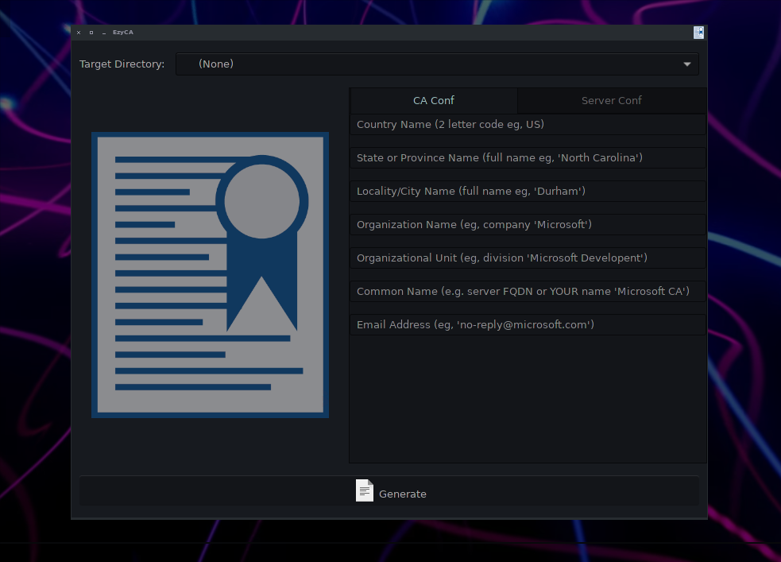
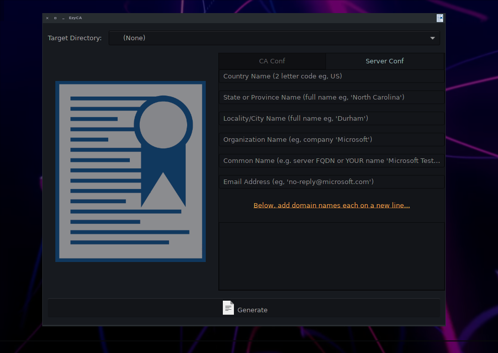

# EzyCA
Easily create Certificate Authorities and sign a server PEM and key for use.

# Requirements
* Need Python 3+
* Need OpenSSL
* Need PyGObject

# Note
This is for development environments ONLY! A proper setup should require that the root CA be password protected. For simplicity, this is not done here. I might edit the code to add such an option through the UI and code flow.

# Images

